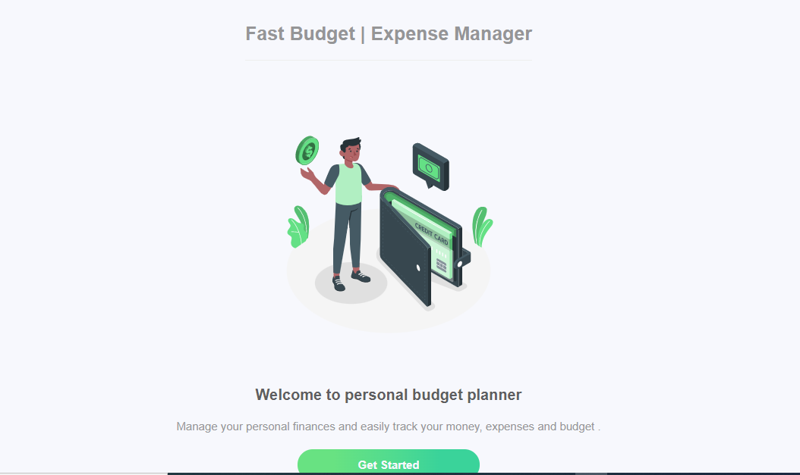
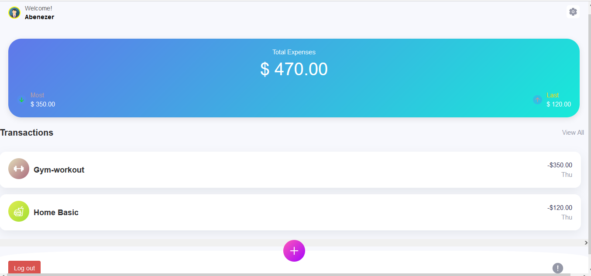

<div align="center">
  <!-- You are encouraged to replace this logo with your own! Otherwise you can also remove it. -->
  
  <br/>

  <h3><b>Fast Budget Expense Manager Application</b></h3>

</div>

<!-- TABLE OF CONTENTS -->

# 📗 Table of Contents

- [📖 About the Project](#about-project)
  - [🛠 Built With](#built-with)
    - [Tech Stack](#tech-stack)
    - [Key Features](#key-features)
  - [🚀 Live Demo](#live-demo)
- [💻 Getting Started](#getting-started)
  - [Prerequisites](#prerequisites)
  - [Setup](#setup)
  - [Install](#install)
  - [Usage](#usage)
  - [Run tests](#run-tests)
  - [Deployment](#deployment)
- [👥 Authors](#authors)
- [🔭 Future Features](#future-features)
- [🤝 Contributing](#contributing)
- [⭐️ Show your support](#support)
- [🙏 Acknowledgements](#acknowledgements)
- [❓ FAQ (OPTIONAL)](#faq)
- [📝 License](#license)

# Budget-app
> A Budget-app is mobile web application where you can manage your budget: you have a list of transactions associated with a category, so that you can see how much money you spent and on what.

> Splash Screen


> Home page


> The goal of the project is to build the RoR application using Ruby on Rails by ruby gems as software packages system.   
Click [Live](https://fast-budget-expense-manager-application.onrender.com/) to get a live preview of the project.

## EDR diagram


## 🛠 Built With <a name="built-with"></a>
Ruby on Rails, Visual Studia Code, WSL

### Tech Stack <a name="tech-stack"></a>

- **Ruby on Rails**
- **PostgreSQL**
- **WSL**

### Key Features <a name="key-features"></a>

- **User Registration and Login**
- **Category Spending Overview**
- **User-Friendly Interface**

<p align="right">(<a href="#readme-top">back to top</a>)</p>

<!-- LIVE DEMO -->

## 🚀 Live Demo <a name="live-demo"></a>

- [Live Demo Link](https://fast-budget-expense-manager-application.onrender.com/)

<p align="right">(<a href="#readme-top">back to top</a>)</p>

## 💻 Getting Started <a name="getting-started"></a>

### Setup <a name="setup"></a>

In order to use this project.. Clone this repository to your desired folder by pasting this command in your command line interface:

  https://github.com/Abenezer-Tilahun/Fast-Budget-Expense-Manager-Application

### Prerequisites <a name="prerequisites"></a>

  Ruby on Rails
  Git

### Install <a name="install"></a>

To install the project's dependencies, run:

```
bundle install
```

### Run tests <a name="run tests"></a>

To test, run:

```
rspec
```

<p align="right">(<a href="#readme-top">back to top</a>)</p>

<!-- AUTHORS -->

## 👥 Authors <a name="authors"></a>

👤 **Abenezer Tilahun**

- GitHub: [Abenezer-Tilahun](https://github.com/Abenezer-Tilahun)
- Twitter: [@AbenezerTilahun11](https://twitter.com/AbenezerTilah11)
- LinkedIn: [@abenezer-tilahun](https://www.linkedin.com/in/abenezer-mesafint-a17a08230/)

<p align="right">(<a href="#readme-top">back to top</a>)</p>

## 🔭 Future Features <a name="future-features"></a>

- **Expense Reminders**
- **Financial Insights**
- **Budget Goals**

<p align="right">(<a href="#readme-top">back to top</a>)</p>

## 🤝 Contributing <a name="contributing"></a>

Contributions, issues, and feature requests are welcome!

Feel free to check the [issues page](https://github.com/Abenezer-Tilahun/Fast-Budget-Expense-Manager-Application/issues/new)

<p align="right">(<a href="#readme-top">back to top</a>)</p>

## ⭐️ Show your support <a name="support"></a>

Kindly give this project a star if you like it.

<p align="right">(<a href="#readme-top">back to top</a>)</p>

## 🙏 Acknowledgments <a name="acknowledgements"></a>

I would like to thank [Gregoire Vella](https://www.behance.net/gregoirevella) for the original [Design](https://www.behance.net/gallery/19759151/Snapscan-iOs-design-and-branding) on Behance.

<p align="right">(<a href="#readme-top">back to top</a>)</p>

## 📝 License <a name="license"></a>

This project is [MIT](/LICENSE) license.

<p align="right">(<a href="#readme-top">back to top</a>)</p>
